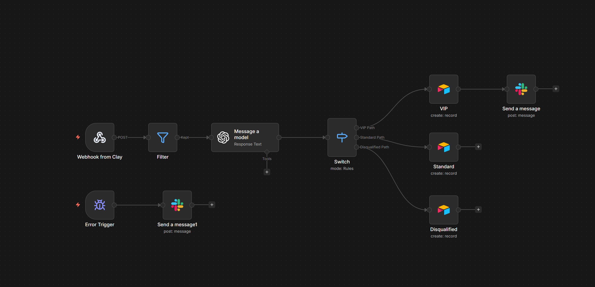
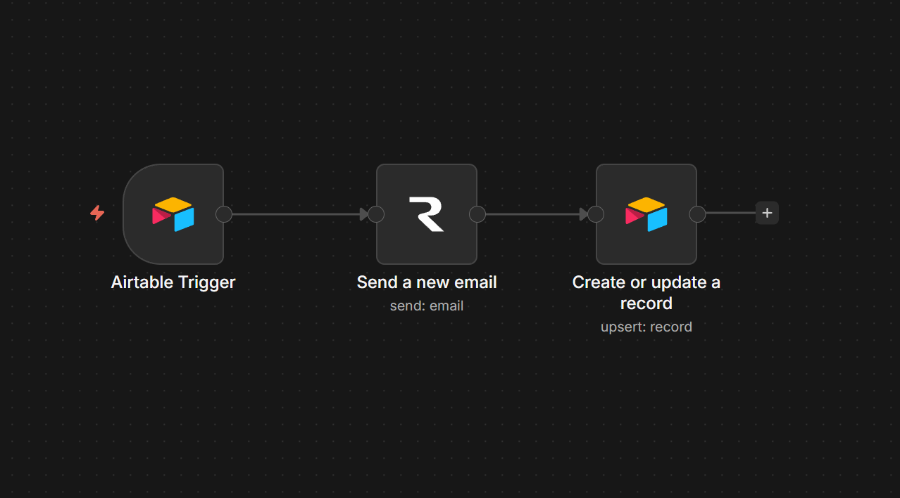
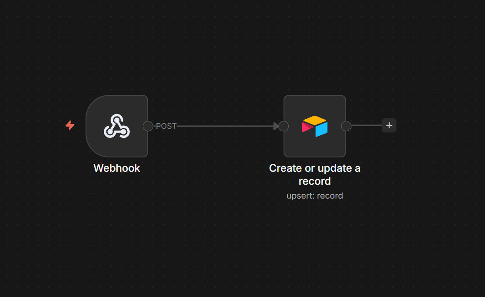
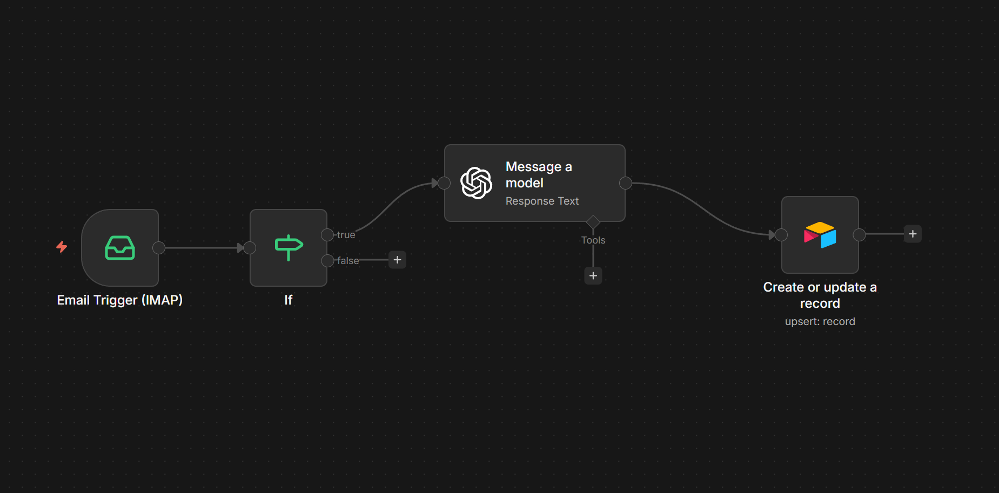
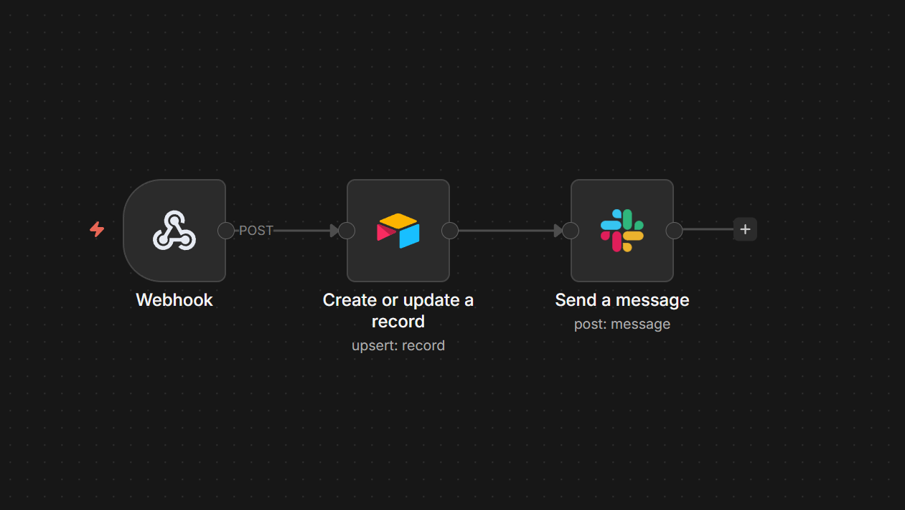
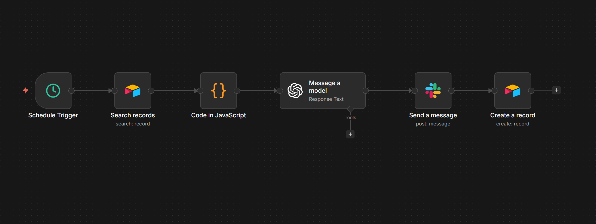
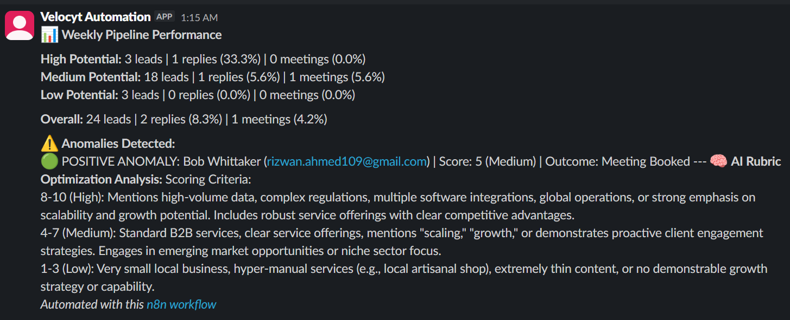

# Intent-Driven Outbound Engine with Closed-Loop AI Optimization

An enterprise-grade, closed-loop Go-To-Market (GTM) automation engine built for scale. This system completely automates the SDR pipeline—from waterfall lead enrichment to AI intent scoring, multi-channel execution, and self-correcting analytics.

**Impact:** The full cycle reduces per-lead outbound time from ~12 minutes (manual SDR workflow) to <60 seconds of human review, a 90%+ efficiency gain. 

## ⚙️ The Pipeline Phases

### Phase 1: Lead Sourcing (Apollo.io)
* Ideal Customer Profile (ICP) lists are generated and exported to a CSV, securing verified B2B contact data (names, companies, emails, websites) as the system's foundational input.
* Ensures the automation engine is fueled exclusively by targeted, high-quality prospects. 

### Phase 2: Data Enrichment & AI Personalization (Clay)
* Raw CSV data is imported into Clay to run through an enrichment waterfall. 
* Live website data for each prospect is scraped. 
* An LLM synthesizes the raw website text to generate a highly personalized, context-aware "Icebreaker" for cold outreach. 
* An HTTP API node pushes a structured JSON payload (containing contact info, scraped text, and the AI icebreaker) directly to a custom, self-hosted server. 

### Phase 3: Logic & Routing Engine (Self-Hosted n8n on DigitalOcean)
 
* **Ingestion:** A Production Webhook node catches the incoming JSON payload in real-time.
* **Validation (Safety Valve):** A Filter node verifies the presence of website text and icebreaker data. The workflow is immediately terminated if data is incomplete, preventing downstream API errors and wasted spend. [
* **Scoring (OpenAI gpt-4o-mini):** Raw website text is analyzed against a strict scoring rubric at a cost of <$0.0001 per lead. The model returns a structured JSON object containing an "Automation Potential" score (1-10) and a brief reasoning statement. 
* **Routing (Switch Node):** Boolean logic evaluates the score to route the lead down one of three distinct execution paths based on intent. 

### Phase 4: Multi-Channel Execution (Slack & Airtable)

* **Low Intent (Score < 4):** Leads are routed to Airtable and logged as "Disqualified" to maintain CRM hygiene. No outreach is generated. 

* **Medium Intent (Score 4-7):** Leads are logged in Airtable with a status of "Draft Created" and a personalized email draft pre-loaded for review. A human operator reviews the draft and, upon approval, updates the Status field to "Approved" which triggers automated delivery via Resend. Post-send, the system tracks engagement through two independent channels: a custom webhook captures invisible pixel fires to log open rates, while a dedicated IMAP trigger monitors the inbox for replies. Incoming responses are passed directly to an LLM for real-time sentiment analysis and intent classification (Positive, Negative, or Meeting Request), with results written back to the lead's Airtable record. 

* **High Intent / VIP (Score >= 8):** A custom Slack App integration instantly fires a real-time alert to a private channel, detailing the lead's score, reasoning, and company. The lead is simultaneously tagged as "High Priority" in Airtable with a personalized email draft staged for review. The same human-in-the-loop approval process applies: delivery, engagement tracking, and reply analysis follow the identical automated pipeline as Medium Intent leads once the operator greenlights the send. 

### Phase 5: Enterprise Auditing & Error Handling 
* **Micro-Cost Tracking:** API token usage (prompt and completion tokens) from the OpenAI node is mapped and calculated dynamically. The exact fractional API cost per lead (averaging <$0.0001) is logged directly into the Airtable database for granular ROI reporting. 
* **Global Error Handling:** An independent Error Trigger node monitors the entire canvas. Any node failure captures the exact error message and execution data, routing an immediate alert to Slack to ensure zero silent failures. 

### Phase 6: Closed-Loop Analytics & Rubric Optimization

* **Outcome Capture:** Downstream engagement signals—email replies, sentiment classifications, and booked meetings—are mapped back to the original lead records in Airtable, creating a complete lifecycle for every lead from initial score to final outcome.
* **Automated Performance Audits:** A scheduled n8n workflow runs weekly, pulling all lead records from the past 7-day cycle. A JavaScript node aggregates reply rates and meeting conversion metrics, grouped by AI Intent Score bucket (High, Medium, Low), and flags anomalies, such as medium-scoring leads that book meetings or high-scoring leads that ghost after opening. The full performance digest is pushed to Slack for operator review.

* **AI-Assisted Rubric Refinement:** Identified anomalies and their associated website text are fed into a GPT-4o prompt alongside the active scoring rubric. The model analyzes discrepancies to surface missing variables or overweighted signals, and proposes specific adjustments to the Phase 3 scoring criteria. A human operator reviews and validates the proposed changes before any updates are applied to the production rubric, ensuring the system learns from its results without introducing unchecked drift. 

* **System Audits & Cost Tracking:** The proposed rubric changes, performance metrics, anomaly lists, and the exact fractional API cost of each optimization run are logged into a dedicated "System Audits" table in Airtable for long-term ROI tracking and historical reference. 

## 🏗️ Technological Stack

The engine leverages a modular, enterprise-grade technology stack designed for scalability, low-latency processing, and maximum cost-efficiency:

* **Lead Sourcing & Data:** Apollo.io is utilized to generate Ideal Customer Profile (ICP) lists and secure verified B2B contact data. 
* **Data Enrichment:** Clay executes waterfall enrichment processes and live website scraping to synthesize personalized context. 
* **Core Orchestration:** A self-hosted n8n environment deployed on a DigitalOcean Linux server ($6/month) serves as the central logic and routing engine. The system is backed by a Postgres database and a Caddy reverse proxy for secure, high-volume webhook ingestion. 
* **Artificial Intelligence:** The OpenAI API powers the cognitive layer. gpt-4o-mini handles high-speed intent scoring <$0.0001 per lead, while gpt-4o manages complex reasoning during the weekly self-correction and rubric optimization audits. Complex data manipulation and statistical calculations are executed natively via JavaScript.
* **CRM & Database of Record:** Airtable acts as the dynamic operational database, managing pipeline hygiene, routing execution, and logging fractional API costs for ROI reporting. 
* **Multi-Channel Execution:** Automated email delivery is managed via Resend, while dedicated IMAP triggers and scheduling webhooks (e.g., Cal.com) monitor downstream engagement. 
* **Internal Operations:** Custom Slack App integrations ensure zero silent failures via global error handling and provide real-time alerts for VIP lead engagement.

## 📂 Repository Contents
* `/assets`: System screenshots, architecture diagrams, and Slack alert examples.
* `/infrastructure`: The `docker-compose.yml` and `Caddyfile` used for the DigitalOcean deployment.
