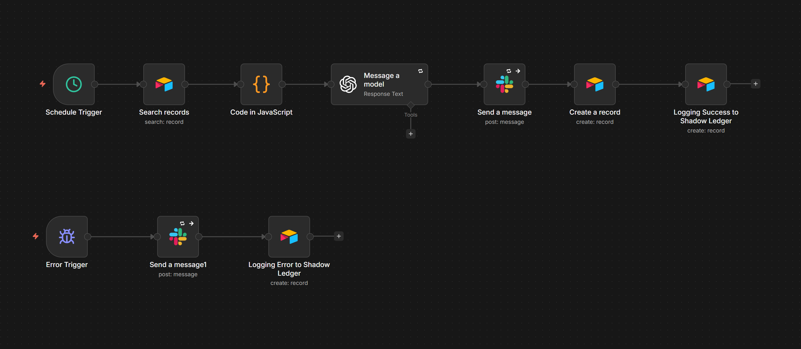

# Intent-Driven Outbound Engine with Closed-Loop AI Optimization

An enterprise-grade, closed-loop Go-To-Market (GTM) automation engine built for scale. This system completely automates the SDR pipeline—from waterfall lead enrichment to AI intent scoring, multi-channel execution, and self-correcting analytics.

**Impact:** The full cycle reduces per-lead outbound time from ~12 minutes (manual SDR workflow) to <60 seconds of human review, a 90%+ efficiency gain.

## 👥 Who This Is For

* B2B companies running outbound at any scale — from lean teams replacing manual SDR workflows to large sales orgs processing tens of thousands of leads per month
* Companies already using Apollo.io + Clay (or similar enrichment tools) for prospecting
* Teams that want human-in-the-loop approval over AI-generated outreach — not fully autonomous sending
* Operators who need a transparent audit trail for every action the system takes

## 🗺️ Architecture at a Glance

The engine is an 8-workflow state machine orchestrated by a self-hosted n8n instance on DigitalOcean. Airtable serves as the single source of truth — every lead record tracks its full lifecycle from ingestion to meeting booked. OpenAI handles the cognitive layer (intent scoring, sentiment analysis, rubric optimization). Resend manages email delivery with open/click tracking via webhooks. Cal.com captures booked meetings. Slack acts as the nervous system — surfacing VIP leads, replies, errors, and weekly performance digests in real time. Every workflow writes to an immutable Shadow Ledger for enterprise-grade auditability.

## 🔁 Example: One Lead's Journey

A single lead flowing through the complete system:

1. **Apollo → Clay → Webhook:** Lead data arrives with enriched company info and an AI-generated icebreaker. The Lead Scoring workflow immediately writes the raw data to Airtable → Status: **"New"**
2. **AI Scoring:** OpenAI analyzes the company's website text, returns a score of 6 (Medium). The record is updated → Status: **"Draft Created"**, Automation Potential: **"Medium"**, Email Draft: pre-loaded
3. **Human Review:** The operator reviews the draft in the "Approved Leads" view, edits the copy, changes Status → **"Approved"**
4. **Email Delivery:** The Executor polls Airtable, locks the record → Status: **"Sending"**, sends via Resend, unlocks → Status: **"Sent"**, Engagement: **"Delivered"**
5. **Open Tracked:** Resend fires a webhook when the recipient opens the email → Engagement: **"Opened"**
6. **Click Tracked:** The recipient clicks the Cal.com booking link → Engagement: **"Clicked"**
7. **Reply Detected:** The prospect replies. IMAP trigger catches it, domain-based search matches the lead, OpenAI classifies sentiment as "Meeting Request" → Status: **"Replied"**, Client's Response: **"Meeting Request"**
8. **Meeting Booked:** The prospect books via Cal.com. Webhook fires → Status: **"Meeting Booked"**, Engagement: **"Goal Reached"**

Every step above generates a Shadow Ledger entry. If any step fails, the Error Trigger catches it, alerts Slack, and logs the failure to the Shadow Ledger.

## ⚙️ The Pipeline Phases

### Phase 1: Lead Sourcing (Apollo.io)
* Ideal Customer Profile (ICP) lists are generated and exported to a CSV, securing verified B2B contact data (names, companies, emails, websites) as the system's foundational input.
* Ensures the automation engine is fueled exclusively by targeted, high-quality prospects.

### Phase 2: Data Enrichment & AI Personalization (Clay)
* Raw CSV data is imported into Clay to run through an enrichment waterfall.
* Live website data for each prospect is scraped.
* An LLM synthesizes the raw website text to generate a highly personalized, context-aware "Icebreaker" for cold outreach.
* An HTTP API node pushes a structured JSON payload (containing contact info, scraped text, and the AI icebreaker) directly to a custom, self-hosted n8n server.

### Phase 3: Database-First Ingestion & AI Scoring (GTM Engine — Lead Scoring)

* **Direct-to-Vault Capture:** The moment a webhook payload arrives from Clay, the raw lead data is written immediately to Airtable with Status "New" — before any processing begins. If OpenAI times out, if n8n restarts mid-execution, or if the Filter kills incomplete data, the lead is never lost. It exists in the database and can be reprocessed.
* **Validation (Safety Valve):** A Filter node verifies the presence of website text and icebreaker data. Incomplete leads remain safely stored as "New" in Airtable for manual investigation, while complete leads proceed to scoring.
* **AI Intent Scoring (OpenAI gpt-4o-mini):** Raw website text is analyzed against a strict scoring rubric at a cost of <$0.0001 per lead. The model returns a structured JSON object containing an "Automation Potential" score (1–10) and a reasoning statement. Retries are configured at 30-second intervals to handle transient API failures.
* **Intent-Based Routing (Switch Node):** Boolean logic evaluates the score to route the lead down one of three distinct execution paths. Each path updates the existing Airtable record (matched by the ID from the initial vault capture) rather than creating a new one.
  * **High Intent (Score 8–10):** Record updated to "Draft Created" with a personalized VIP email draft. A real-time Slack alert fires to a private channel with the lead's score, reasoning, and company details.
  * **Medium Intent (Score 4–7):** Record updated to "Draft Created" with a standard personalized email draft staged for human review.
  * **Low Intent (Score 1–3):** Record updated to "Disqualified." No outreach generated.

### Phase 4: Database-First Email Delivery (GTM Engine — Email Delivery)

* **Anti-Duplicate Lock:** The Executor polls Airtable every minute for "Approved" records. Before sending any email, the system immediately updates the record's Status to "Sending" — removing it from the polling view. This prevents race conditions where overlapping polling cycles could trigger duplicate sends.
* **Automated Delivery:** Once locked, the email is sent via Resend with retries configured for transient failures. On success, Status updates to "Sent" and Engagement to "Delivered." On failure after all retries, the record remains in "Sending" status — the Slack alert identifies exactly which node failed, allowing the operator to determine whether the email was sent and take appropriate action.
* **Human-in-the-Loop:** A dedicated Airtable view filters for "Approved" records only. A human operator reviews each draft and approves it by changing Status to "Approved," which triggers the automated delivery pipeline.

### Phase 5: Multi-Channel Engagement Tracking

* **Open Tracking (GTM Engine — Open Tracker):** A dedicated Resend webhook captures invisible pixel fires. When a recipient opens an email, the system upserts the lead's Engagement field to "Opened" using the record ID tag embedded in the original email.

* **Click Tracking (GTM Engine — Click Tracker):** A separate Resend webhook captures link click events. When a recipient clicks a link (e.g., the Cal.com booking link), Engagement is updated to "Clicked." Click always overrides Open status, maintaining a progressive engagement funnel.

* **Reply Detection & Sentiment Analysis (GTM Engine — Reply Catcher):** An IMAP trigger monitors the inbox for incoming replies. Instead of fragile subject-line matching, the system performs a domain-based Airtable search — extracting the sender's email domain and matching it against known leads with Status "Sent" or "Approved." This catches replies from alternate email addresses within the same company. Matched replies are passed to OpenAI gpt-4o-mini for real-time sentiment classification (Positive, Negative, or Meeting Request). Results are written back to the lead's Airtable record, and a Slack notification fires with the sender, sentiment, and subject line. API cost per classification is tracked in the Shadow Ledger.

* **Meeting Tracking (GTM Engine — Meeting Tracker):** A Cal.com webhook fires when a prospect books a meeting. The system upserts the lead's Status to "Meeting Booked" and Engagement to "Goal Reached," then sends a real-time Slack alert. This completes the full engagement funnel: Delivered → Opened → Clicked → Goal Reached.

### Phase 6: Enterprise Auditing & Fault Tolerance

#### The Shadow Ledger
* A universal, append-only audit trail across all seven workflows. Every execution — success or failure — is recorded into a centralized, immutable Airtable table (Shadow Ledger) tracking: Workflow Name, Node Executed, Outcome, Error Message, Lead Email, Execution ID, API Cost, Timestamp, and Ledger ID.
* The Ledger ID is an auto-number field — records cannot be edited, reordered, or deleted, ensuring a forensic-grade audit trail.

#### Global Error Handling
* Every workflow includes an independent Error Trigger node that catches failures from any node in the workflow. The error path follows a consistent pattern across all seven workflows: **Error Trigger → Slack Alert (with retry, continue on error) → Shadow Ledger Write.**
* This ensures that even if the Slack notification fails, the Shadow Ledger still captures the failure. Slack nodes on error paths are configured with "Continue on Error" so that logging is never blocked by a notification failure.

#### Retry Logic
* **Resend (email send):** Retry with 30-second intervals, stop workflow on final failure.
* **OpenAI (scoring & sentiment):** Retry with 30-second intervals, stop workflow on final failure.
* **Slack (notifications):** Retry with 5-second intervals, continue on error (notifications are non-critical).
* Webhooks (Open Tracker, Click Tracker, Meeting Tracker) do not use retries — they must respond immediately to the sending service.

#### Micro-Cost Tracking
* API token usage from OpenAI is calculated dynamically and tracked in two locations:
  * **Table 1 (OpenAI API Cost field):** Records the scoring cost per lead in the Lead Scoring workflow and the audit cost in the System Audit table.
  * **Shadow Ledger (API Cost field):** Records sentiment analysis cost from the Reply Catcher (the only workflow where the Shadow Ledger is the sole cost record).
* This dual-tracking avoids duplication while ensuring complete cost visibility across the system.

### Phase 7: Closed-Loop Analytics & Self-Correction (GTM Engine — Weekly Audit)

* **Automated Performance Audits:** A scheduled workflow runs weekly, pulling all lead records from the past 7-day cycle. A JavaScript node aggregates reply rates and meeting conversion metrics grouped by AI Intent Score bucket (High, Medium, Low), and flags anomalies:
  * **Positive Anomalies:** Medium or Low-scoring leads that booked meetings or received positive replies — indicating the rubric undervalued certain business types.
  * **Negative Anomalies:** High-scoring leads that opened/clicked but ghosted, or replied negatively — indicating the rubric overvalued certain traits.

* **AI-Assisted Rubric Refinement:** Identified anomalies and performance data are fed into GPT-4o-mini alongside the active scoring rubric. The model analyzes discrepancies to surface missing variables or overweighted signals, and proposes specific adjustments to the Phase 3 scoring criteria. A human operator reviews and validates proposed changes before any updates are applied to the production rubric.
* **System Audit Logging:** The proposed rubric changes, performance metrics, anomaly lists, and the exact fractional API cost of each optimization run are logged into a dedicated "System Audit" table in Airtable for long-term ROI tracking and historical reference. The full performance digest and AI rubric analysis are posted to Slack for operator review.

## 🏗️ Technology Stack

| Layer | Technology | Purpose |
|-------|-----------|---------|
| Lead Sourcing | Apollo.io | ICP list generation, verified B2B contact data |
| Data Enrichment | Clay | Waterfall enrichment, live website scraping, AI icebreaker generation |
| Core Orchestration | Self-hosted n8n on DigitalOcean | Central logic, routing, and execution engine (Postgres + Caddy reverse proxy) |
| AI Layer | OpenAI API (gpt-4o-mini) | Intent scoring (<$0.0001/lead), sentiment analysis, rubric optimization |
| CRM & Database | Airtable | Operational database, pipeline management, Shadow Ledger, System Audit |
| Email Delivery | Resend | Automated sending with open/click webhook tracking |
| Reply Monitoring | IMAP | Inbox monitoring for prospect replies |
| Scheduling | Cal.com | Meeting booking with webhook integration |
| Internal Ops | Slack (Custom App) | Real-time alerts for VIP leads, replies, meetings, errors, and weekly audits |

## 🔧 System Topology

### 8 Active Workflows
1. **GTM Engine — Lead Scoring:** Webhook → Database-first vault capture → Filter → OpenAI scoring → Intent-based routing → Airtable update → Slack alert (VIP only) → Shadow Ledger
2. **GTM Engine — Email Delivery:** Airtable poll → Lock (Status: Sending) → Resend → Unlock (Status: Sent) → Shadow Ledger
3. **GTM Engine — Open Tracker:** Resend webhook → Airtable upsert (Engagement: Opened) → Shadow Ledger
4. **GTM Engine — Click Tracker:** Resend webhook → Airtable upsert (Engagement: Clicked) → Shadow Ledger
5. **GTM Engine — Reply Catcher:** IMAP trigger → Domain-based Airtable search → OpenAI sentiment analysis → Airtable upsert → Slack notification → Shadow Ledger
6. **GTM Engine — Meeting Tracker:** Cal.com webhook → Airtable upsert (Status: Meeting Booked, Engagement: Goal Reached) → Slack alert → Shadow Ledger
7. **GTM Engine — Weekly Audit:** Scheduled trigger → Airtable search → JavaScript aggregation → OpenAI rubric analysis → Slack digest → System Audit log → Shadow Ledger
8. **GTM Engine — Shadow Ledger:** (Inactive sub-workflow, retained for reference — logging is performed directly within each workflow)

### 3 Airtable Tables
* **Table 1 (Pipeline):** Lead records with full lifecycle tracking (New → Draft Created → Approved → Sending → Sent → Opened → Clicked → Replied → Meeting Booked)
* **Shadow Ledger:** Immutable, append-only audit trail across all workflows
* **System Audit:** Weekly performance digests, anomaly reports, and proposed rubric changes

## 🛡️ Enterprise-Grade Properties

| Property | Implementation |
|----------|---------------|
| **Zero data loss** | Database-first vault capture — lead data is written to Airtable before any processing begins. If OpenAI, n8n, or any downstream service fails, the raw data is already persisted. |
| **Anti-duplicate sends** | Status-based record locking ("Sending") removes records from the polling view before email dispatch, preventing overlapping execution cycles from triggering double sends. |
| **Immutable audit trail** | The Shadow Ledger uses auto-numbered Ledger IDs and auto-generated timestamps. Records are append-only — no edits, no deletions, forensic-grade traceability. |
| **Self-healing retries** | External API calls (OpenAI, Resend, Slack) are configured with automatic retries at 30-second intervals. Transient failures resolve without human intervention. |
| **Graceful degradation** | Slack notifications use "continue on error" so a notification failure never blocks data operations or audit logging. The Shadow Ledger is always the last line of defense. |
| **Closed-loop learning** | Weekly automated audits detect scoring anomalies and propose rubric adjustments, ensuring the AI scoring model improves with each cycle based on real-world outcomes. |
| **Human override points** | Email drafts require explicit operator approval before sending. AI-proposed rubric changes require human validation before deployment. No fully autonomous actions on high-stakes operations. |

## 🖥️ Production Considerations

* **Hosting:** Self-hosted n8n on a DigitalOcean Linux droplet ($6/month), backed by a Postgres database and Caddy reverse proxy for SSL termination and high-volume webhook ingestion
* **Secrets Management:** All API keys (OpenAI, Resend, Airtable, Slack) stored as n8n credentials — never hardcoded in workflow logic
* **Backups:** Airtable serves as the persistent data layer; n8n execution history is configured to save all production executions (success and failure) for post-mortem analysis
* **Rate Limits:** The Executor polls at 1-minute intervals, processing one record per cycle. At scale, this can be adjusted by switching to batch processing or reducing the polling interval. OpenAI gpt-4o-mini handles high concurrency; Resend's rate limits are the binding constraint for email throughput
* **Scaling:** For volumes beyond 50k leads/month, the architecture supports horizontal scaling by adding n8n worker nodes and partitioning the Airtable pipeline by campaign or region

## 📂 Repository Contents
* `/assets`: System screenshots, architecture diagrams, and Slack alert examples.
* `/infrastructure`: The `docker-compose.yml` and `Caddyfile` used for the DigitalOcean deployment.
